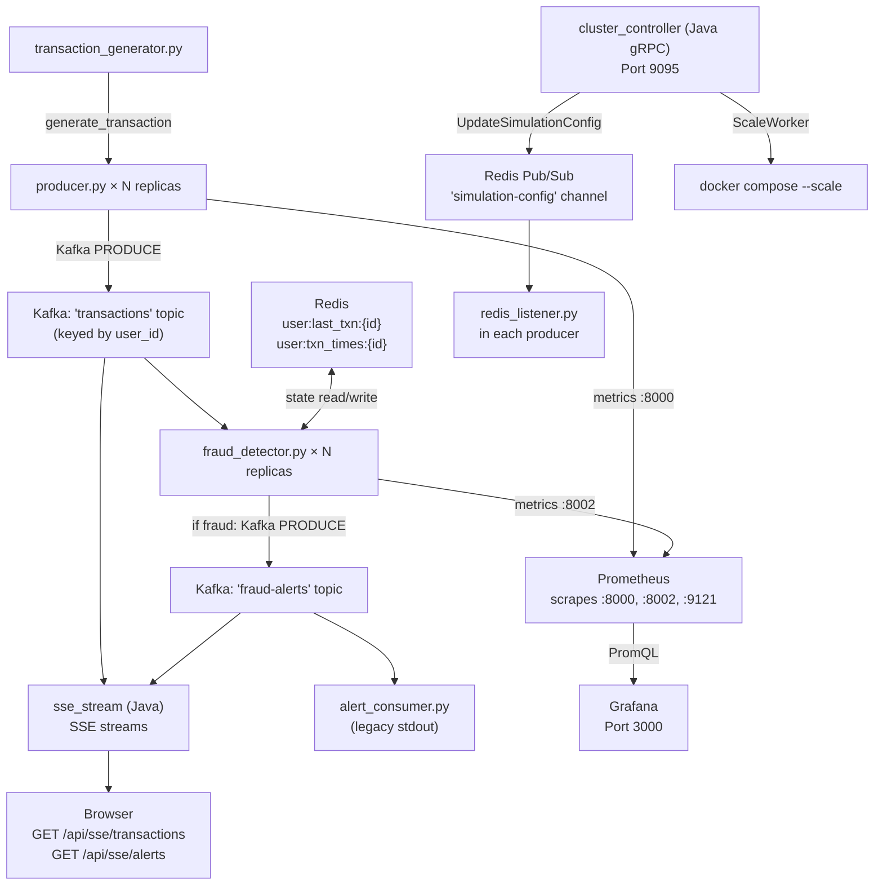

# Documentation Index

This directory contains in-depth technical documentation for every service, worker, and infrastructure component in the **Distributed Fraud Detection Pipeline**.

For a quick-start guide and project overview, see the [main README](../README.md) at the project root.

---

## Contents

| Document | What it covers |
| :--- | :--- |
| [workers.md](./workers.md) | Python data-plane: `producer.py`, `fraud_detector.py`, `alert_consumer.py`, `redis_listener.py`, `transaction_generator.py`, `config.py` |
| [sse_stream.md](./sse_stream.md) | Java Spring WebFlux SSE proxy: Kafka consumers, Reactor Sinks, SSE endpoints, data models |
| [cluster_controller.md](./cluster_controller.md) | Java gRPC control plane: component roles, Strategy Pattern, DooD containerisation, Kubernetes migration strategy |
| [monitoring.md](./monitoring.md) | Prometheus scrape config, DNS service discovery, Grafana provisioning, available metrics |
| [infrastructure.md](./infrastructure.md) | Docker Compose topology, Kafka KRaft setup, Redis roles, networking, port reference |
| [ARCHITECTURE_DECISIONS.md](./ARCHITECTURE_DECISIONS.md) | Full Architecture Decision Record (ADR) — why every major technology and pattern was chosen |

---

## System-Level Data Flow

---

## Conventions Used in These Docs

- **Service name** refers to the Docker Compose service identifier (e.g., `producer`, `fraud-detector`)
- **Port (internal)** means accessible only within the `fraud-detection-net` Docker network
- **Port (host)** means mapped to `localhost` on your machine

> **Note on `ARCHITECTURE_DECISIONS.md`:**
> The canonical version lives at the project root ([`../ARCHITECTURE_DECISIONS.md`](../ARCHITECTURE_DECISIONS.md)) and is referenced by the main `README.md`. The copy here is for convenience when browsing documentation locally.
