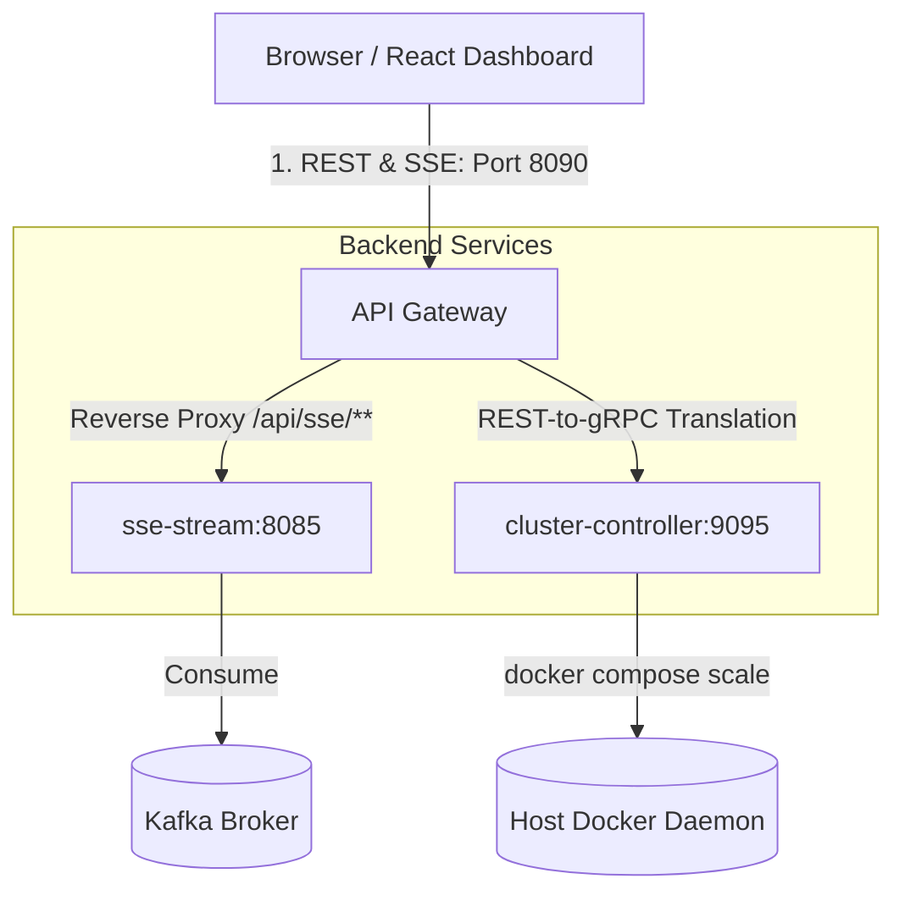

# API Gateway: Service Documentation

The `api_gateway` is a **Java 17 Spring Boot** microservice built using **Spring Cloud Gateway (WebFlux)**. It serves as the single unified entry point for the React frontend dashboard, resolving the protocol and architectural gaps in our system.

---

## Why the API Gateway Exists

The system contains services communicating with different protocols:
1. **`sse_stream`** speaks HTTP Server-Sent Events (port `8085`).
2. **`cluster_controller`** speaks binary gRPC (port `9095`).
3. **`dashboard-ui`** (browser) speaks HTTP, but **browsers cannot natively initiate gRPC communication** (they lack HTTP/2 framing access and generated client code).

The API Gateway bridges this gap by acting as:
- A **reactive reverse proxy** that routes SSE requests directly to the `sse_stream` service.
- A **REST-to-gRPC translator** that exposes REST controllers to the frontend and translates incoming JSON requests into binary Protobuf payloads to call the `cluster_controller` over gRPC.

---

## Architecture Summary



---

## Routing Table

The gateway handles requests based on path predicates:

| Incoming Path | Method | Routed To | Protocol / Action | Purpose |
| :--- | :--- | :--- | :--- | :--- |
| `/api/sse/**` | `GET` | `http://sse-stream:8085` | **HTTP SSE Passthrough** | Streams transactions and alerts to the dashboard |
| `/api/cluster/health/{service}` | `GET` | `cluster-controller:9095` | **gRPC translation** (`GetClusterHealth`) | Retrieves replica counts and health of workers |
| `/api/cluster/scale` | `POST` | `cluster-controller:9095` | **gRPC translation** (`ScaleWorker`) | Scales worker containers up/down |
| `/api/cluster/config` | `POST` | `cluster-controller:9095` | **gRPC translation** (`UpdateSimulationConfig`) | Updates simulation speed, users, and burst probability |

---

## Class-by-Class Breakdown

### `ApiGatewayApplication.java` — Entry Point
Standard Spring Boot application bootstrapper. It starts the reactive netty-based web server on port `8090` and configures the Spring Cloud Gateway routes.

### `CorsConfig.java` — Global Cross-Origin Configuration
Since the React frontend runs on port `3001` (or `5173` locally) and talks to the gateway on port `8090`, CORS is required. This configuration registers a reactive `CorsWebFilter` bean allowing all headers, methods, and credentials for development flexibility.

### `ClusterController.java` — The REST-to-gRPC Translator
Exposes the endpoints `/api/cluster/*`. It receives REST JSON payloads, converts them to Protobuf builder objects, and uses an auto-injected gRPC blocking stub to issue RPCs to the `cluster_controller`.
To prevent blocking Netty's reactive event loop (which would cause thread starvation), the blocking gRPC calls are wrapped in Project Reactor's `Mono.fromCallable()` and scheduled on the `Schedulers.boundedElastic()` thread pool.

### `ScaleRequestDto.java` & `ConfigRequestDto.java` — Data Transfer Records
Immutable Java records decorated with Jackson `@JsonProperty` annotations to map incoming camelCase/snake_case JSON fields into typed Java values.

---

## Protobuf Compilation & Code Generation

The gateway includes the same `cluster_service.proto` file as the `cluster_controller`. 
When running `./gradlew build`, the `com.google.protobuf` Gradle plugin:
1. Downloads `protoc 3.25.5` compiler.
2. Compiles `.proto` schemas using the `grpc-java` plugin.
3. Places generated code in `build/generated/source/proto/main/`.
4. Adds these generated folders to the source sets so the compiler and IDE can resolve stubs like `ClusterServiceGrpc.ClusterServiceBlockingStub`.

---

## Ports & Configuration

| Port | Exposure | Purpose |
| :--- | :--- | :--- |
| `8090` | Host + Docker network | Unified API port for browser access |

**Environment Variables:**

| Variable | Default | Description |
| :--- | :--- | :--- |
| `SSE_STREAM_URI` | `http://localhost:8085` | URI of the SSE stream service |
| `CLUSTER_CONTROLLER_GRPC_ADDRESS` | `static://localhost:9095` | Address of the cluster-controller gRPC server |

---

## Containerisation

The `api_gateway` uses a **multi-stage Docker build**:
1. **Stage 1 (Builder):** Runs on `eclipse-temurin:17-jdk`, compiles the protobuf schemas, resolves dependencies, and packs a standalone Spring Boot fat JAR.
2. **Stage 2 (Runtime):** Copies the compiled JAR to a lightweight `eclipse-temurin:17-jre` image (~200MB), reducing security vulnerability surface area.

---

## Running Locally (Outside Docker)

You can run the gateway on your host machine against local instances of `sse_stream` and `cluster_controller`:

```bash
# Ensure sse-stream is running on port 8085 and cluster-controller is running on port 9095
cd api_gateway
./gradlew bootRun
```

The gateway endpoints will be available at `http://localhost:8090/`.
