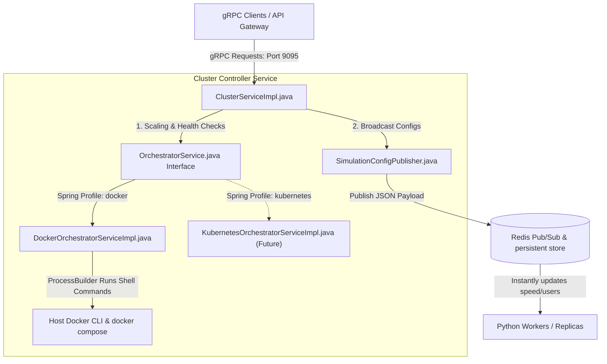

# Cluster Controller: Component Roles & Containerisation Strategy

This guide provides a comprehensive breakdown of the `cluster_controller` microservice architecture, details the procedure for containerising it within a Docker Compose environment, and presents a strategic roadmap for your eventual migration to Kubernetes.

---

## 1. Project Component Roles

The `cluster_controller` is the control plane ("brain") of the fraud detection system. It provides a high-throughput, low-latency gRPC interface that translates administrative decisions (scaling, updating transaction simulator parameters) into runtime operations.

Here is the role of each component in the codebase:



### Class-by-Class Breakdown

| Package | Class / Interface | Responsibility & Role |
| :--- | :--- | :--- |
| **`com.frauddetection.cluster_controller`** | `ClusterControllerApplication.java` | **Microservice Entry Point**<br>Boots the Spring Boot application, scans the project for configurations, starts the embedded gRPC server on port `9095`, and connects to the Redis network instance. |
| **`com.frauddetection.cluster_controller.config`** | `RedisConfig.java` | **Connection & Serialization Setup**<br>Registers and configures Spring's `StringRedisTemplate` bean. This ensures all interaction with Redis uses standard UTF-8 string encoding, which is optimal for publishing JSON payloads. |
| **`com.frauddetection.cluster_controller.service`** | `SimulationConfigPublisher.java` | **Redis Configuration Broadcaster**<br>Serializes dynamic simulator parameters (`num_users`, `speed_multiplier`, `burst_probability`) into JSON and performs two actions:<br>1. **Persistence:** Saves the JSON payload to the Redis key `simulation:current-config` so new containers can fetch it on boot.<br>2. **Real-time Broadcast:** Publishes the payload to the Redis Pub/Sub channel `simulation-config` to instantly update running Python workers on-the-fly without container restarts. |
| **`com.frauddetection.cluster_controller.orchestrator`** | `OrchestratorService.java` | **Strategy Pattern Abstraction Interface**<br>Defines the technology-agnostic operations for managing the worker containers: `scaleService()`, `getRunningCount()`, and `getServiceStatus()`. This keeps the API implementation decoupled from Docker or Kubernetes. |
| **`com.frauddetection.cluster_controller.orchestrator`** | `DockerOrchestratorServiceImpl.java` | **Docker Compose Orchestration Engine**<br>The concrete strategy that implements `OrchestratorService`. Active only when the Spring profile is `docker`. It uses Java's native `ProcessBuilder` to execute shell commands (`docker compose up -d --scale ...` and `docker compose ps`) in the directory containing `docker-compose.yml`. |
| **`com.frauddetection.cluster_controller.grpc`** | `ClusterServiceImpl.java` | **gRPC Request Handler (The Heart)**<br>Exposes three RPC endpoints (`ScaleWorker`, `UpdateSimulationConfig`, `GetClusterHealth`), enforces safety guards (a service whitelist preventing users from scaling infrastructure like Kafka or Redis), validates inputs, and delegates actions to the services above. |

---

## 2. Procedure to Containerise the Cluster Controller

Containerising the Cluster Controller in a local Docker Compose setup is uniquely challenging. Because `DockerOrchestratorServiceImpl` runs standard shell commands (`docker` and `docker compose`) using `ProcessBuilder`, **a default Java container will crash** with a `No such file or directory` exception because it lacks the Docker client and access to the Docker daemon.

To solve this, we use the **Docker-out-of-Docker (DooD)** pattern.

### Step 1: Create the `Dockerfile`

Create a `Dockerfile` under the `/cluster_controller` directory that uses a lightweight JDK base, installs the Docker CLI client, and includes the Docker Compose plugin:

```dockerfile
# Use Eclipse Temurin JRE 21 alpine for a minimal footprint
FROM eclipse-temurin:21-jre-alpine

# Install Docker CLI and Docker Compose CLI plugin
RUN apk add --no-cache docker-cli docker-cli-compose bash

# Set the working directory inside the container
WORKDIR /app

# Copy the pre-built jar file from Gradle build
COPY build/libs/cluster_controller-0.0.1-SNAPSHOT.jar app.jar

# Expose the gRPC port
EXPOSE 9095

# Command to execute the microservice
ENTRYPOINT ["java", "-jar", "app.jar"]
```

### Step 2: Update the `docker-compose.yml` File

Add the `cluster-controller` service block. To allow the containerized Java app to manage your host's Docker daemon, you must mount the host's Docker socket and mount the project's folder containing your compose files:

```yaml
  cluster-controller:
    build: ./cluster_controller
    container_name: cluster-controller
    ports:
      - "9095:9095"                      # Expose gRPC port to the host
    environment:
      - REDIS_HOST=redis
      - ORCHESTRATOR_PROFILE=docker
      # Set the working directory for Docker Compose inside the container
      - COMPOSE_PROJECT_DIR=/app/project
    volumes:
      # CRITICAL: Mount host's Docker daemon socket (DooD pattern)
      - /var/run/docker.sock:/var/run/docker.sock
      # CRITICAL: Mount the host's project folder containing docker-compose.yml
      # so that ProcessBuilder can execute compose commands on it
      - .:/app/project
    depends_on:
      redis:
        condition: service_healthy
```

> [!WARNING]
> **Docker-out-of-Docker Path Translation Caveat**
> When a containerised application runs `docker compose` via `/var/run/docker.sock`, the Docker daemon (running on your host) is the one executing the instructions. When the daemon mounts volumes or builds paths, it evaluates them relative to the **host's file system**, not the controller container's directory structure.
> For this local DooD setup to work seamlessly, ensure that relative volume bindings inside `docker-compose.yml` (like `./prometheus.yml`) are preserved.

---

## 3. Timing and Kubernetes Migration Strategy

Considering your ultimate goal is to migrate to Kubernetes, here is an engineering analysis of when to containerise the controller and why.

### Q1: Can I containerise it now?
**Yes, but it is currently blocked.**
You have written the configuration correctly, but because your host's Docker Desktop daemon is currently shut down (as seen when running `docker compose ps`), booting the stack or the containerised controller will fail until you start Docker Desktop.

### Q2: When *should* I containerise it?
You should containerise it locally **only if** you want to run completely hands-off automated integration tests, or if you need a single-command deploy (`docker compose up`) to spin up your entire local development environment including the controller.

During active feature development, **we strongly advise keeping the Cluster Controller running natively on your host machine** (directly through VS Code, IntelliJ, or Gradle) rather than inside a Docker container.
* **Instant Recompiles:** Containerising means you have to rebuild the Docker image on every Java code change. Running locally allows instant hot-swaps or rapid Spring Boot restarts.
* **Native Debugging:** You can easily attach breakpoints, profile JVM memory, and step through ProcessBuilder execution.
* **Zero Socket Friction:** You avoid writing complex volume mappings and setting file permissions on `/var/run/docker.sock`.

### Q3: Considering the Kubernetes migration, do I only do this change at the end?
**Absolutely YES.** You should defer the containerisation setup until you migrate the stack to Kubernetes. 

Here is why: **Kubernetes completely breaks the shell-command pattern, making your Docker containerisation code obsolete.**

```mermaid
graph TD
    subgraph Local_Docker_DooD [Local Docker (DooD Setup)]
        Doc[cluster-controller container] -->|1. Mounts| Sock["/var/run/docker.sock (Host Socket)"]
        Doc -->|2. Requires| Binary["docker & docker-compose client binaries inside image"]
        Doc -->|3. Execs| Shell["ProcessBuilder runs 'docker compose up'"]
    end
    
    subgraph K8s_Production [Kubernetes (Declarative API Setup)]
        K8sDoc[cluster-controller pod] -->|1. Standard Image| NoExtra["Standard lightweight JVM image (No Docker client, no socket mounts)"]
        K8sDoc -->|2. Secures| ServiceAccount["ServiceAccount + RBAC RoleBinding"]
        K8sDoc -->|3. Calls| K8sAPI["HTTPS REST requests to Kubernetes API Server"]
    end
```

#### The Architecture Shifts 180° Under Kubernetes:

1. **No More Shell Commands (`ProcessBuilder`):**
   In Kubernetes, you do not shell out to execute `kubectl` or `docker compose`. Doing so is a major security risk and highly inefficient. Instead, you use a dedicated Java library—the **Fabric8 Kubernetes Client** or the official **Kubernetes Java SDK**.
2. **Declarative State Changes:**
   Instead of launching dynamic processes, the Java code will make an HTTPS REST call to the Kubernetes API server to patch the `spec.replicas` field of a `Deployment` resource. The Kubernetes control plane handles the rest.
3. **No Sockets, Clean Images:**
   The controller will *not* need Docker CLI or `/var/run/docker.sock` in its container image. The image will be a standard, secure JVM runtime.
4. **RBAC Authorization:**
   Access to the Kubernetes API is secured natively. Your controller pod will be assigned a **ServiceAccount** configured with a **Role** and **RoleBinding** that grants it explicit permission to list/patch Deployments in the namespace.

### Summary Strategy Recommendation

1. **Local Phase (Now):** Continue running `cluster_controller` locally on your host JVM using `COMPOSE_PROJECT_DIR` and `REDIS_HOST=localhost`. It is the fastest, easiest debugging flow.
2. **Kubernetes Migration Phase (End):**
   * Write a clean `KubernetesOrchestratorServiceImpl` implementing `OrchestratorService` using the **Fabric8 Kubernetes Client**.
   * Annotate it with `@Profile("kubernetes")`.
   * Switch the active profile in `application.yml` to `kubernetes`.
   * Containerise the Java app using a basic, lightweight `Dockerfile` (no Docker/compose client CLI packages).
   * Deploy the containerised controller directly to Kubernetes as a Pod, backed by a proper Kubernetes ServiceAccount.
