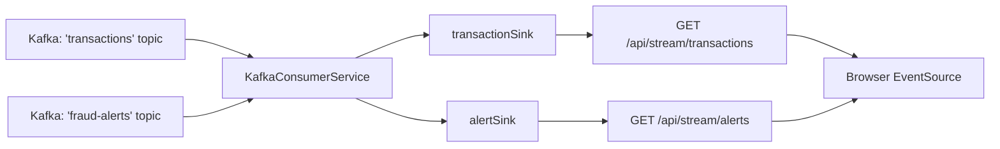

# Dashboard API: Service Documentation

The `dashboard_api` is a **Java 17 Spring Boot** microservice that acts as the reactive bridge between the Kafka event stream and the browser. It consumes messages from two Kafka topics and forwards them to connected browser clients in real time using **Server-Sent Events (SSE)**.

---

## Architecture Summary



This service solves a fundamental protocol incompatibility: browsers speak HTTP (or WebSocket), but Kafka speaks a custom binary TCP protocol. The `dashboard_api` is the translator that sits in between.

---

## Why Spring WebFlux (Reactive Stack)?

This project uses `spring-boot-starter-webflux` (the reactive, non-blocking web stack) rather than the traditional `spring-boot-starter-web` (Servlet, blocking).

**The key advantage for SSE:** In the traditional Servlet model, each open HTTP connection occupies an entire dedicated OS thread for its lifetime. With SSE, connections stay open indefinitely (one per browser tab). A blocking server would quickly run out of threads under moderate load.

WebFlux uses a small, fixed thread pool (typically 1 thread per CPU core) with an event loop. Threads are never blocked waiting — they handle events as they arrive. This means the dashboard can serve **thousands of concurrent SSE subscribers** on the same hardware that would struggle with dozens in the blocking model.

---

## Class-by-Class Breakdown

### `DashboardApiApplication.java` — Entry Point

Boots the Spring Boot application. On startup, Spring auto-detects all `@Configuration`, `@Service`, and `@RestController` beans in the `com.frauddetection.dashboard_api` package and wires them together. The embedded Netty server (WebFlux's default) starts on port `8085`.

---

### `KafkaConfig.java` — Kafka Consumer Factory

**Why this class exists:** Spring Boot's Kafka auto-configuration only registers the `kafkaListenerContainerFactory` bean when using the **Servlet** stack (`spring-boot-starter-web`). When you switch to WebFlux, the auto-configuration is absent and `@KafkaListener` annotations will silently fail to connect to the broker.

This class manually creates and registers the two required beans:

| Bean | Type | Purpose |
| :--- | :--- | :--- |
| `consumerFactory` | `ConsumerFactory<String, String>` | Creates Kafka Consumer instances pre-configured with the broker address, group ID, and `StringDeserializer` |
| `kafkaListenerContainerFactory` | `ConcurrentKafkaListenerContainerFactory` | Manages the threads that poll Kafka and dispatch messages to `@KafkaListener` methods |

**Why `StringDeserializer` for both key and value?**
The Kafka messages are raw JSON strings produced by the Python workers. This service consumes from two different topics with two different JSON schemas (`TransactionEvent` and `AlertEvent`). A single `JsonDeserializer` cannot handle multiple target types. Instead, all messages are read as raw `String` and Jackson's `ObjectMapper` handles type-specific deserialization downstream in `KafkaConsumerService`.

**Configuration (read from `application.yml`):**
```yaml
spring:
  kafka:
    bootstrap-servers: ${KAFKA_BOOTSTRAP_SERVERS:kafka:9092}
    consumer:
      group-id: fraud-dashboard-group
      auto-offset-reset: latest
```

`auto-offset-reset: latest` means the dashboard only streams events that arrive **after it connects** — it does not replay historical Kafka messages on startup. This is intentional for a real-time dashboard use case.

---

### `KafkaConsumerService.java` — Kafka-to-SSE Bridge

**Role:** The central messaging hub. It listens to Kafka on two separate `@KafkaListener` threads and publishes events into two **Project Reactor Sinks** — one for transactions, one for alerts. The `SseController` then exposes these sinks as HTTP streams.

**Sink Configuration:**
```java
Sinks.many().multicast().directBestEffort()
```

- **`multicast()`** — When a Kafka message arrives, it is broadcast to all currently-subscribed SSE clients simultaneously. Each client gets their own independent `Flux` subscription.
- **`directBestEffort()`** — If a subscriber is slow (backpressure), events for that subscriber are **dropped** rather than buffered. This prevents unbounded memory growth if a client's connection is laggy. Dropped events are logged.

**Deserialization Strategy:**
```java
@KafkaListener(topics = "transactions", groupId = "dashboard-tx-group")
public void listenTransactions(String message) {
    TransactionEvent event = OBJECT_MAPPER.readValue(message, TransactionEvent.class);
    transactionSink.tryEmitNext(event);
}
```
Jackson's `ObjectMapper` maps the incoming JSON string to the typed Java POJO. `@JsonIgnoreProperties(ignoreUnknown = true)` on the models ensures that if the Python producer adds new fields in the future, deserialization will not throw an error.

**Consumer Groups:**
- `dashboard-tx-group` listens to `transactions`
- `dashboard-alert-group` listens to `fraud-alerts`

These group IDs are independent from the Python workers' groups (`fraud-detector-group`, `alert-service-group`). This means **Kafka delivers a copy of every event to both the Python fraud detector AND the Java dashboard** — they do not compete for messages.

---

### `SseController.java` — HTTP SSE Endpoints

**Role:** Exposes the Reactor Sinks from `KafkaConsumerService` as HTTP endpoints using Spring WebFlux's native SSE support.

**Endpoints:**

| Endpoint | Method | Produces | Description |
| :--- | :--- | :--- | :--- |
| `/api/stream/transactions` | `GET` | `text/event-stream` | Continuous stream of all financial transactions |
| `/api/stream/alerts` | `GET` | `text/event-stream` | Continuous stream of fraud alert events |

**How SSE Works:**
When a browser opens a connection to `/api/stream/transactions`, Spring WebFlux:
1. Subscribes to the `Flux<TransactionEvent>` returned by the controller method
2. Sets `Content-Type: text/event-stream` on the HTTP response
3. Keeps the connection open indefinitely
4. For each event emitted by the Flux, it serialises the POJO to JSON and writes it as `data:{json}\n\n` to the open connection
5. The browser's native `EventSource` API parses this format and fires a JavaScript event for each message

**`@CrossOrigin(origins = "*")`** is set on the controller to allow the React frontend (running on a different port during development) to make SSE requests. This should be locked down to the specific frontend origin in production.

**Backpressure Handling:**
```java
return kafkaConsumerService.getTransactionStream()
        .onBackpressureDrop(dropped ->
            logger.warn("Dropped transaction event (backpressure): userId={}", dropped.getUserId())
        );
```
If a browser client cannot consume events fast enough, dropped events are logged at `WARN` level and discarded.

---

### `TransactionEvent.java` — Transaction Data Model

A Java POJO that maps 1:1 to the JSON produced by `transaction_generator.py`. Uses `@JsonProperty` annotations to bridge Python's `snake_case` field naming to Java's `camelCase` conventions.

**Example mapping:**
```java
@JsonProperty("transaction_id")
private String transactionId;    // Python "transaction_id" → Java transactionId
```

`@JsonIgnoreProperties(ignoreUnknown = true)` provides forward-compatibility — any new fields added to the Python producer are silently ignored rather than throwing a deserialization error.

**Full Field List:**

| JSON Field | Java Field | Type | Description |
| :--- | :--- | :--- | :--- |
| `transaction_id` | `transactionId` | `String` | UUID |
| `timestamp` | `timestamp` | `String` | ISO-8601 UTC |
| `event_epoch_ms` | `eventEpochMs` | `long` | Epoch milliseconds |
| `user_id` | `userId` | `String` | Simulated user identifier |
| `account_id` | `accountId` | `String` | Account linked to user |
| `amount` | `amount` | `double` | Transaction amount (USD) |
| `currency` | `currency` | `String` | Always `"USD"` |
| `merchant_id` | `merchantId` | `String` | Random merchant |
| `merchant_category` | `merchantCategory` | `String` | e.g., `grocery`, `gaming` |
| `payment_method` | `paymentMethod` | `String` | e.g., `credit_card`, `e_wallet` |
| `channel` | `channel` | `String` | `online`, `in_store`, `mobile_app` |
| `card_present` | `cardPresent` | `boolean` | Physical card used? |
| `device_id` | `deviceId` | `String` | Device identifier |
| `device_type` | `deviceType` | `String` | `android`, `ios`, `desktop` |
| `ip_address` | `ipAddress` | `String` | Simulated internal IP |
| `country` | `country` | `String` | ISO country code |
| `city` | `city` | `String` | City name |
| `latitude` | `latitude` | `double` | Geographic coordinate |
| `longitude` | `longitude` | `double` | Geographic coordinate |

---

### `AlertEvent.java` — Fraud Alert Data Model

Maps the alert JSON published by `fraud_detector.py` to the `fraud-alerts` Kafka topic.

| JSON Field | Java Field | Type | Description |
| :--- | :--- | :--- | :--- |
| `alert_id` | `alertId` | `String` | `"alert-{transaction_id}"` |
| `created_at` | `createdAt` | `String` | ISO-8601 timestamp of alert creation |
| `transaction` | `transaction` | `TransactionEvent` | The full offending transaction (nested object) |
| `fraud_reasons` | `fraudReasons` | `List<String>` | Which rules fired (e.g., `["huge_amount"]`) |
| `detector_context` | `detectorContext` | `Map<String, Object>` | Flexible context: distance, window count, etc. |
| `severity` | `severity` | `String` | `"high"` or `"medium"` |

`detectorContext` is typed as `Map<String, Object>` deliberately — the Python detector may include different keys depending on which rules triggered. A strongly typed Java class would fail if a new key was added.

---

## Containerisation

The `dashboard_api` uses a **multi-stage Docker build** for a minimal, secure production image:

**Stage 1 — Builder (`eclipse-temurin:17-jdk`):**
- Downloads Gradle dependencies (separate layer, cached unless `build.gradle` changes)
- Compiles the Spring Boot fat JAR via `./gradlew bootJar --no-daemon -x test`
- Tests are skipped in image builds (run separately in CI)

**Stage 2 — Runtime (`eclipse-temurin:17-jre`):**
- Copies only the compiled JAR from Stage 1
- The full JDK and Gradle wrapper are excluded from the final image (~200 MB vs ~600 MB)
- Runs with `ENTRYPOINT ["java", "-jar", "app.jar"]` (exec form ensures the JVM receives `SIGTERM` for graceful shutdown)

---

## Ports & Configuration

| Port | Exposure | Purpose |
| :--- | :--- | :--- |
| `8085` | Host + Docker network | Main API port for SSE endpoints |

**Environment Variables:**

| Variable | Default | Description |
| :--- | :--- | :--- |
| `KAFKA_BOOTSTRAP_SERVERS` | `kafka:9092` | Kafka broker address |

---

## Running Locally (Outside Docker)

The `dashboard_api` can run on your host machine against the Dockerized Kafka:

```bash
# Set env vars so the app connects to the host-exposed Kafka port
export KAFKA_BOOTSTRAP_SERVERS=localhost:9094
cd dashboard_api
./gradlew bootRun
```

The SSE streams will be available at:
- `http://localhost:8085/api/stream/transactions`
- `http://localhost:8085/api/stream/alerts`
