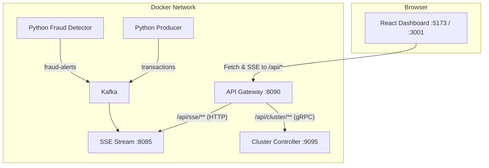

# Dashboard UI: Service Documentation

The `frontend/` directory contains a **React + TypeScript** single-page application that provides a real-time monitoring dashboard for the fraud detection pipeline. It connects to the API Gateway (`api_gateway`) to display live transaction data, fraud alerts, and scale the worker cluster.

## Architecture Overview



## Technology Stack

| Technology | Purpose |
|------------|---------|
| **React 19** | Component-based UI framework |
| **TypeScript** | Type safety — catches bugs at compile time instead of runtime |
| **Vite** | Dev server with hot module reload + production bundler |
| **Vanilla CSS** | Design system with CSS custom properties (no Tailwind dependency) |
| **nginx** | Production static file server + reverse proxy (Docker only) |

## Component Architecture

```
App.tsx                          ← Root orchestrator
├── Navbar.tsx                   ← Logo, connection indicator, live clock
├── StatsBar.tsx                 ← 4 KPI metric cards (TPS, totals, rates)
├── Dashboard Grid (CSS Grid)
│   ├── TransactionFeed.tsx      ← Scrolling table of recent transactions
│   └── AlertPanel.tsx           ← Fraud alert cards with severity badges
└── ClusterControls.tsx          ← Scaling buttons (fully active)
```

### Data Flow

```
                              ──→ useTransactionStream hook ──→ transactions[] ──→ TransactionFeed
                             │                                                 ──→ StatsBar (TPS, total)
api-gateway:8090 ──→ Browser │
                             │──→ useAlertStream hook       ──→ alerts[]        ──→ AlertPanel
                             │                                                 ──→ StatsBar (alerts, rate)
                             │
                              ──→ useClusterApi hook        ──→ ClusterControls (scale / health)
```

## Custom Hooks

### `useTransactionStream`
Opens an `EventSource` connection to `/api/sse/transactions` via the API Gateway. Maintains a rolling buffer of the 100 most recent transactions. Auto-reconnects with exponential backoff (1s → 2s → 4s → ... → 30s max) if the connection drops.

### `useAlertStream`
Same pattern as above, but connects to `/api/sse/alerts` and maintains up to 50 alerts.

### `useStats`
Derives computed statistics from the raw event counts:
- **TPS (Transactions Per Second):** Uses a 5-second sliding window. Timestamps of recent events are stored in a buffer, and a 1-second interval prunes old entries and divides the count by 5.
- **Alert Rate:** Simple percentage: `(totalAlerts / totalTransactions) * 100`.

### `useClusterApi`
Wraps REST endpoints exposed by the API Gateway to interact with the cluster control plane:
- `fetchHealth(service)`: Queries current active replicas and status via `GET /api/cluster/health/{service}`.
- `scaleService(service, replicas)`: Invokes container scaling via `POST /api/cluster/scale`.
- `updateConfig(config)`: Adjusts simulation speed, users, and burst probability via `POST /api/cluster/config`.

## How SSE Works in the Browser

Server-Sent Events (SSE) is a simple, browser-native protocol for server-to-client streaming:

1. The browser opens a long-lived HTTP GET request to the SSE endpoint.
2. The server keeps the connection open and sends events in this format:
   ```
   data:{"transaction_id":"abc","amount":250.50,...}\n\n
   ```
3. The browser's `EventSource` API parses each `data:` line and fires an `onmessage` callback.
4. If the connection drops, `EventSource` automatically reconnects (we add our own exponential backoff on top).

**Why SSE instead of WebSocket?**
We only need server → client streaming (no data goes back to the server). SSE is simpler, works through HTTP proxies and load balancers without special configuration, and is natively supported by Spring WebFlux. WebSocket would be overkill.

## Design System

The CSS design system lives in `src/index.css` and uses CSS custom properties (variables) for theming:

| Token | Value | Usage |
|-------|-------|-------|
| `--bg-deepest` | `#0a0e1a` | Page background |
| `--bg-primary` | `#111827` | Panel backgrounds |
| `--accent-blue` | `#3b82f6` | Interactive elements |
| `--accent-emerald` | `#10b981` | Success states, low amounts |
| `--accent-amber` | `#f59e0b` | Warnings, medium severity |
| `--accent-red` | `#ef4444` | Danger, high severity |

Key visual features:
- **Glassmorphism panels:** `backdrop-filter: blur()` with subtle borders
- **Fade-in animations:** New table rows and alert cards slide in smoothly
- **Pulsing connection dot:** Green when connected, red when disconnected
- **Color-coded amounts:** Green (< $500), amber ($500-$5000), red (> $5000)
- **Active Scaling Buttons:** Interactive `+` and `-` buttons with hover, active, and loading/disabled states.

## Running Locally

### Prerequisites
- Node.js 18+ (for the Vite dev server)
- Docker Desktop (for the backend services)

### Development Mode (with hot reload)

```bash
# 1. Start backend services
docker compose up -d

# 2. Stop Docker versions of Java microservices to run them locally (optional for local Java debugging)
docker compose stop sse-stream cluster-controller api-gateway

# 3. Start cluster-controller (in terminal 1)
cd cluster_controller && COMPOSE_PROJECT_DIR=".." REDIS_HOST="localhost" ./gradlew bootRun

# 4. Start sse-stream (in terminal 2)
cd sse_stream && KAFKA_BOOTSTRAP_SERVERS="localhost:9094" ./gradlew bootRun

# 5. Start api-gateway (in terminal 3)
cd api_gateway && ./gradlew bootRun

# 6. Start the React dev server (in terminal 4)
cd frontend && npm run dev
```

Open http://localhost:5173 — you should see live transactions streaming in, and cluster control scaling buttons will be interactive.

**How the proxy works in dev mode:**
Vite's dev server proxies `/api/*` requests to `http://localhost:8090` (configured in `vite.config.ts`), which is the API Gateway port. This avoids CORS errors since the browser thinks all requests go to `localhost:5173`.

### Production Mode (via Docker)

```bash
# Build and start everything
docker compose up -d --build

# The dashboard is available at:
# http://localhost:3001
```

In production, nginx inside the `dashboard-ui` container handles the proxying. Requests to `/api/*` are forwarded to the `api-gateway` container on port `8090` over the Docker network.

## Port Map

| Port | Service | Access |
|------|---------|--------|
| `5173` | Vite dev server | Dev only — `npm run dev` |
| `3001` | nginx (Docker) | Production — `docker compose up` |
| `8090` | API Gateway | Host Entry point (proxied by Vite/nginx) |
| `8085` | SSE Stream API | Backend (internal access only) |
| `9095` | Cluster Controller | Control Plane gRPC (internal access only) |
