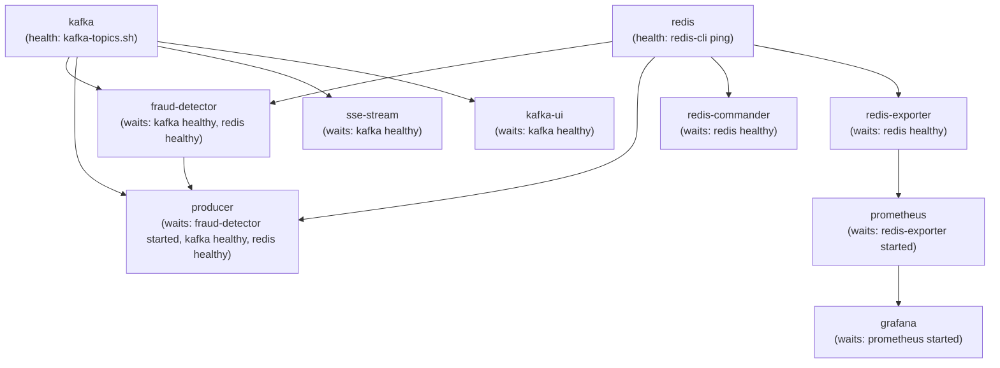

# Infrastructure: Docker Compose, Kafka & Redis Documentation

This document covers the infrastructure layer of the fraud detection pipeline — the services that every application-level component depends on. These are defined in `docker-compose.yml` at the project root and managed entirely by Docker Compose.

---

## Docker Compose Overview

**File:** `docker-compose.yml`

The entire system can be cold-booted with a single command:
```bash
docker compose up --build
```

All services communicate over a single Docker-managed network: `fraud-detection-net`.

### Full Service Map

| Service | Image/Build | Internal Port | Host Port | Role |
| :--- | :--- | :--- | :--- | :--- |
| `kafka` | `apache/kafka:3.7.2` | `9092`, `9093`, `9094` | `9094` | Message broker |
| `redis` | `redis/redis-stack:latest` | `6379`, `8001` | `6379`, `8001` | State store + UI |
| `kafka-ui` | `provectuslabs/kafka-ui:latest` | `8080` | `8080` | Kafka browser UI |
| `redis-commander` | `rediscommander/redis-commander:latest` | `8081` | `8081` | Redis browser UI |
| `producer` | `./workers` (Python) | `8000` | — | Transaction generator |
| `fraud-detector` | `./workers` (Python) | `8002` | — | Fraud detection engine |
| `sse-stream` | `./sse_stream` (Java) | `8085` | `8085` | SSE streaming API |
| `prometheus` | `prom/prometheus:latest` | `9090` | `9090` | Metrics collection |
| `grafana` | `grafana/grafana:latest` | `3000` | `3000` | Metrics visualisation |
| `redis-exporter` | `oliver006/redis_exporter:latest` | `9121` | — | Redis → Prometheus bridge |

### Network: `fraud-detection-net`

All services share a single default Docker bridge network named `fraud-detection-net`. Within this network:
- Services resolve each other by their **service name** as a DNS hostname (e.g., `kafka`, `redis`, `producer`)
- Ports tagged `expose:` are only reachable from within the network
- Ports tagged `ports:` are mapped to the host machine and accessible from your browser

This design means the Kafka plaintext listener (`kafka:9092`) and Redis (`redis:6379`) are **never exposed on localhost** by default (except Redis `6379` which is host-mapped for local Java development).

---

## Apache Kafka

**Image:** `apache/kafka:3.7.2`
**Mode:** KRaft (no ZooKeeper)

### KRaft Mode (No ZooKeeper)

Traditional Kafka required ZooKeeper for cluster coordination (leader election, metadata management). Since Kafka 3.x, the **KRaft** (Kafka Raft Metadata) mode replaces ZooKeeper with Kafka's own built-in Raft consensus, eliminating an entire infrastructure dependency.

In our setup, the single Kafka broker acts as both broker and controller (combined mode), which is appropriate for local development.

### Listener Configuration

Kafka exposes three listeners:

| Listener | Address | Protocol | Purpose |
| :--- | :--- | :--- | :--- |
| `PLAINTEXT` | `kafka:9092` | Plaintext | Container-to-container traffic (all Python workers and Java apps) |
| `CONTROLLER` | `kafka:9093` | Plaintext | Internal KRaft controller communication |
| `EXTERNAL` | `localhost:9094` | Plaintext | Host machine access (for local dev tools, `kcat`, etc.) |

```yaml
environment:
  - KAFKA_LISTENERS=PLAINTEXT://:9092,CONTROLLER://:9093,EXTERNAL://:9094
  - KAFKA_ADVERTISED_LISTENERS=PLAINTEXT://kafka:9092,EXTERNAL://localhost:9094
```

The `ADVERTISED_LISTENERS` are what Kafka tells clients to connect to after initial discovery. `kafka:9092` resolves correctly inside Docker; `localhost:9094` resolves correctly from your host machine.

### Topic Configuration

| Topic | Partitions | Replication Factor | Producers | Consumers |
| :--- | :--- | :--- | :--- | :--- |
| `transactions` | 3 | 1 | `producer.py` | `fraud_detector.py`, `sse_stream` |
| `fraud-alerts` | 3 | 1 | `fraud_detector.py` | `sse_stream`, `alert_consumer.py` |

**Why 3 partitions?**
Each partition can be consumed by one consumer replica within a consumer group. With 3 partitions, scaling to 3 fraud-detector replicas gives each replica its own dedicated partition — perfect parallelism.

**Why replication factor 1?**
We have exactly one broker. A replication factor greater than 1 would require multiple brokers. For local development, factor 1 is correct.

### Partition Keying Strategy

The `producer.py` keys every Kafka message by `user_id`:
```python
producer.produce(
    settings.transactions_topic,
    value=json_serializer(transaction),
    key=transaction["user_id"].encode(),   # ← partition key
    callback=delivery_report,
)
```

**Why this matters for fraud detection:** Kafka guarantees that all messages with the same key land on the same partition, and the same consumer replica always reads the same partition. This means all transactions for `user-1042` always go to the same fraud detector replica. That replica holds the user's sliding window state in Redis and can make ordering-dependent decisions without coordination overhead.

### Health Check

The Kafka service has a health check that runs `kafka-topics.sh --list` every 10 seconds. Other services that depend on Kafka use `condition: service_healthy`, meaning they will not start until Kafka passes this check. This prevents connection errors during cold boot.

### Kafka UI

**URL:** `http://localhost:8080`

The Kafka UI provides a browser interface for:
- Browsing topics, viewing partition counts and offsets
- Inspecting consumer groups and lag
- Viewing individual messages in JSON format
- Creating/deleting topics manually

---

## Redis Stack

**Image:** `redis/redis-stack:latest`
**Ports:** `6379` (Redis protocol), `8001` (RedisInsight UI)

Redis serves two distinct roles in this system:

### Role 1: Fraud Detector State Store

The fraud detector stores per-user state in Redis to support its detection rules:

| Key Pattern | Type | TTL | Content |
| :--- | :--- | :--- | :--- |
| `user:last_txn:{user_id}` | String (JSON) | 24 hours | Previous transaction's location/timestamp for impossible-travel check |
| `user:txn_times:{user_id}` | Sorted Set | `2 × window_seconds` | Transaction IDs scored by epoch-ms for sliding-window high-frequency check |

**Why Redis over in-process memory?**
If the fraud detector is scaled to 3 replicas, each has its own isolated RAM. Without a shared store, Replica A would not know about the user's previous transaction if it was processed by Replica B. Redis acts as the single source of truth accessible by all replicas simultaneously.

All Redis commands used for fraud detection are atomic operations (ZADD, ZREMRANGEBYSCORE, ZCARD, SETEX, GET) — no locks, no transactions needed.

### Role 2: Simulation Config Pub/Sub

Redis Pub/Sub is used by the Cluster Controller to broadcast live simulation parameter changes to all running Python workers:

| Channel | Publisher | Subscribers |
| :--- | :--- | :--- |
| `simulation-config` | Java `SimulationConfigPublisher` | All `producer` replicas (via `redis_listener.py`) |

| Key | Type | Content |
| :--- | :--- | :--- |
| `simulation:current-config` | String (JSON) | Latest simulation config (persistent fallback for new replicas) |

Pub/Sub messages are fire-and-forget — they are not stored. New replicas that start after a config update read from the `simulation:current-config` key instead.

### Redis Stack vs. Plain Redis

`redis/redis-stack:latest` bundles the standard Redis server with:
- **RedisInsight UI** on port `8001` — a browser-based visual client for inspecting keys, running commands, and monitoring memory
- Additional Redis modules (RediSearch, RedisJSON) — not currently used but available

For our purposes, the only benefit over `redis:latest` is the bundled RedisInsight UI.

### Redis Commander

**URL:** `http://localhost:8081`

A lightweight alternative Redis browser for quick key inspection. Useful for verifying that:
- `user:last_txn:u-XXXX` keys are being created correctly
- `user:txn_times:u-XXXX` sorted sets are populated with recent transactions
- `simulation:current-config` reflects the latest cluster controller broadcast

---

## Dependency Ordering & Health Checks

Docker Compose starts services in dependency order using `depends_on`:



The `producer` waits for `fraud-detector: service_started` (not `healthy`) — this is intentional to ensure the Kafka consumer group is registered before the producer starts sending messages.

---

## Scaling Workers

To scale the `producer` or `fraud-detector` services:

```bash
# Scale producers to 3 replicas
docker compose up -d --scale producer=3 --no-recreate

# Scale fraud detectors to 3 replicas
docker compose up -d --scale fraud-detector=3 --no-recreate
```

**`--no-recreate`** is critical: it tells Docker "do not stop and restart containers that are already running — just add new ones to reach the target count."

**Why `container_name` is not set on scalable services:**
If `container_name: producer` were set in `docker-compose.yml`, Docker would refuse to create a second instance (container names must be unique). By omitting `container_name`, Docker auto-generates unique names like `fraud-detection-producer-1`, `fraud-detection-producer-2`, etc.

Infrastructure services (`kafka`, `redis`, `prometheus`, `grafana`, etc.) do have `container_name` set because they are singletons and are referenced by hostname in inter-service URLs.

---

## Port Reference

**Browser-accessible from host:**

| URL | Service | Purpose |
| :--- | :--- | :--- |
| `http://localhost:8085/api/stream/transactions` | sse-stream | Live SSE transaction stream |
| `http://localhost:8085/api/stream/alerts` | sse-stream | Live SSE fraud alert stream |
| `http://localhost:8080` | kafka-ui | Kafka topic browser |
| `http://localhost:8081` | redis-commander | Redis key browser |
| `http://localhost:8001` | redis (RedisInsight) | Visual Redis client |
| `http://localhost:9090` | prometheus | Metrics UI + PromQL |
| `http://localhost:3000` | grafana | Dashboards (admin/admin) |

**Internal Docker network only:**

| Address | Service | Used by |
| :--- | :--- | :--- |
| `kafka:9092` | Kafka PLAINTEXT | All Python workers, sse-stream |
| `kafka:9093` | Kafka CONTROLLER | Kafka internal (KRaft) |
| `redis:6379` | Redis | fraud-detector, redis-listener, redis-exporter |
| `producer:8000` | Producer metrics | Prometheus |
| `fraud-detector:8002` | Detector metrics | Prometheus |
| `redis-exporter:9121` | Redis metrics | Prometheus |
