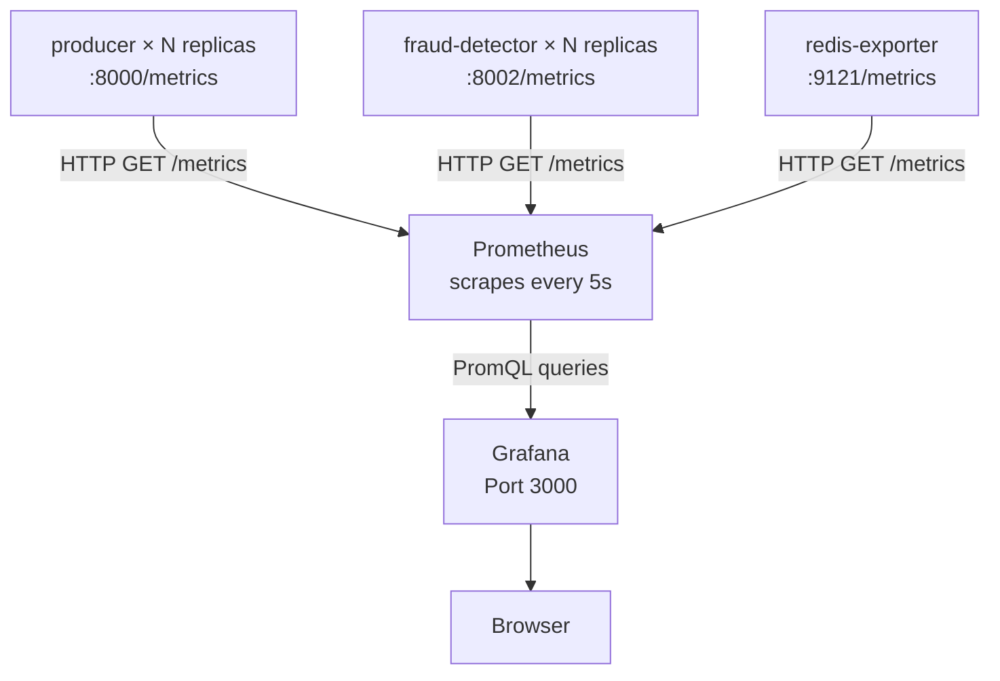

# Monitoring Stack: Prometheus & Grafana Documentation

The monitoring stack provides full **observability** over the fraud detection pipeline — tracking transaction throughput, fraud alert rates, detection latency, Redis memory usage, and the health of every horizontally scaled service replica.

It runs as two containers inside the `docker-compose.yml` stack: **Prometheus** (metrics collection and storage) and **Grafana** (dashboard visualisation).

---

## Architecture Overview



---

## Prometheus

**Image:** `prom/prometheus:latest`
**Port:** `9090` (Web UI + HTTP API)
**Config file:** `prometheus.yml` (mounted read-only into the container)

### How Prometheus Works

Prometheus operates on a **pull model** — rather than services pushing metrics to it, Prometheus periodically sends HTTP `GET` requests to each target's `/metrics` endpoint and stores the returned time-series data. This is the inverse of most logging systems.

Each Python worker exposes a `/metrics` endpoint using `prometheus_client.start_http_server()`. Redis metrics are exposed by the `redis-exporter` sidecar, which reads `INFO` from Redis and translates it into Prometheus format.

### `prometheus.yml` Configuration

```yaml
global:
  scrape_interval:     5s   # How often to scrape every target
  evaluation_interval: 5s   # How often alerting rules are evaluated

scrape_configs:

  - job_name: "producer"
    dns_sd_configs:
      - names: ["producer"]
        type: "A"
        port: 8000

  - job_name: "fraud-detector"
    dns_sd_configs:
      - names: ["fraud-detector"]
        type: "A"
        port: 8002

  - job_name: "redis"
    static_configs:
      - targets: ["redis-exporter:9121"]
```

### Static Configs vs. DNS Service Discovery

> **This is one of the most important configuration decisions in this project. See [Architecture Decision 14](./ARCHITECTURE_DECISIONS.md).**

**The Problem with `static_configs` for scaled services:**

When `producer` is scaled to 3 replicas, Docker assigns each replica its own IP address. The hostname `producer` in Docker's DNS round-robins between those IPs. If Prometheus uses `static_configs: [{targets: ["producer:8000"]}]`:

1. Scrape 1 → resolves to `172.20.0.5` (Container A, counter = 200)
2. Scrape 2 → resolves to `172.20.0.6` (Container B, counter = 80)
3. Scrape 3 → resolves to `172.20.0.7` (Container C, counter = 45)

Prometheus sees the counter decrease from 200 → 80. The `rate()` function interprets a counter decrease as a **counter reset** (i.e., the process crashed and restarted). It adds the pre-reset value to the post-reset value, generating a massive artificial spike in your Grafana graphs.

**The Solution — DNS Service Discovery (`dns_sd_configs`):**

```yaml
dns_sd_configs:
  - names: ["producer"]
    type: "A"
    port: 8000
```

Instead of treating `producer:8000` as a single load-balanced target, Prometheus performs a DNS `A` record lookup for `producer`. Docker's DNS server returns **all IPs** of all running replicas simultaneously:

```
producer → [172.20.0.5, 172.20.0.6, 172.20.0.7]
```

Prometheus creates **three separate scrape targets** — one per IP. Each replica is monitored independently and continuously. Counters only ever increase within a single target, so `rate()` always produces correct, non-spiking values.

`redis-exporter` uses `static_configs` because it is a singleton (never scaled), so DNS service discovery is unnecessary.

### Prometheus Web UI

Accessible at `http://localhost:9090`. Useful for:
- **Targets page** (`/targets`): Verify all service replicas are being discovered and their status is `UP`.
- **Graph page**: Run ad-hoc PromQL queries.
- **Service Discovery page** (`/service-discovery`): Inspect what DNS returned for each job.

### Key Metrics Available

**From `producer` (one series per replica):**

| Metric | Type | Description |
| :--- | :--- | :--- |
| `producer_transactions_produced_total` | Counter | Total messages successfully delivered to Kafka |
| `producer_errors_total` | Counter | Total Kafka delivery failures |

**From `fraud-detector` (one series per replica):**

| Metric | Type | Labels | Description |
| :--- | :--- | :--- | :--- |
| `detector_transactions_processed_total` | Counter | `outcome=ok\|fraud` | Transactions evaluated, split by result |
| `detector_fraud_reasons_total` | Counter | `reason=huge_amount\|location_anomaly\|high_frequency_transactions` | Count per fraud rule |
| `detector_evaluation_duration_seconds` | Histogram | — | Per-transaction evaluation latency |
| `detector_window_transaction_count` | Gauge | — | Most recent sliding-window transaction count |

**From `redis-exporter`:**

| Metric | Description |
| :--- | :--- |
| `redis_memory_used_bytes` | Current Redis memory consumption |
| `redis_connected_clients` | Number of connected clients |
| `redis_commands_processed_total` | Total Redis commands processed |
| `redis_keyspace_hits_total` | Cache hit count |
| `redis_keyspace_misses_total` | Cache miss count |

---

## Grafana

**Image:** `grafana/grafana:latest`
**Port:** `3000` (Web UI)
**Login:** `admin` / `admin` (change on first login)

### Auto-Provisioning

Grafana is fully provisioned via volume mounts — no manual setup through the UI is required:

```
grafana/
├── provisioning/
│   ├── datasources/    ← Auto-registers Prometheus as a data source
│   └── dashboards/     ← Auto-discovers dashboard JSON files
└── dashboards/
    └── fraud-detection.json   ← The main dashboard definition
```

**How provisioning works:**
1. On startup, Grafana reads the `datasources/` directory and registers any YAML-defined data sources. Our Prometheus instance (`http://prometheus:9090`) is registered automatically — you never need to add it manually.
2. Grafana reads `dashboards/` provisioning config, which points to the `grafana/dashboards/` directory. Any `.json` files there are imported as dashboards automatically.

### `fraud-detection.json` Dashboard

The main Grafana dashboard provides the following panels:

**Transaction Throughput**
```promql
sum(rate(producer_transactions_produced_total[1m]))
```
Sums the per-second production rate across all producer replicas. With DNS service discovery, this accurately scales with the number of replicas.

**Fraud Alert Rate**
```promql
sum(rate(detector_transactions_processed_total{outcome="fraud"}[1m]))
```
Per-second rate of fraud detections.

**Fraud Breakdown by Rule**
```promql
sum by (reason) (rate(detector_fraud_reasons_total[1m]))
```
Separate series per fraud rule, showing the relative frequency of each.

**Detection Latency (P95)**
```promql
histogram_quantile(0.95, sum(rate(detector_evaluation_duration_seconds_bucket[1m])) by (le))
```
The 95th percentile evaluation latency — how long the worst 5% of fraud checks take.

**Redis Memory Usage**
```promql
redis_memory_used_bytes
```
Direct memory usage of the Redis instance.

**Sliding Window Size (Gauge)**
```promql
detector_window_transaction_count
```
Shows the current transaction density per user, indicating how close users are to triggering the high-frequency rule.

---

## Redis Exporter (`redis-exporter`)

**Image:** `oliver006/redis_exporter:latest`
**Port:** `9121` (internal only, scraped by Prometheus)

The redis-exporter is a sidecar container that runs the `INFO` command against Redis every few seconds and exposes the parsed output as Prometheus-format metrics on port `9121`. It connects to Redis via the Docker network (`redis://redis:6379`).

It has no UI of its own — it is purely a translation layer between Redis's proprietary INFO format and Prometheus's text-based exposition format.

---

## Running & Troubleshooting

**Start the monitoring stack:**
```bash
docker compose up -d prometheus grafana redis-exporter
```

**Verify Prometheus targets are healthy:**
1. Open `http://localhost:9090/targets`
2. All targets should show `State: UP`
3. For `producer` and `fraud-detector` jobs, you should see one entry per running replica (e.g., 3 targets if scaled to 3)

**Reload Prometheus config without restart:**
```bash
curl -X POST http://localhost:9090/-/reload
```

**Check DNS resolution inside Prometheus container (debugging):**
```bash
docker exec prometheus nslookup producer
# Should return multiple A records when replicas > 1
```

**Grafana dashboard not loading:**
- Check that `grafana/provisioning/datasources/` contains a YAML file pointing to `http://prometheus:9090`
- Verify `grafana/dashboards/fraud-detection.json` exists and is valid JSON
- Check Grafana logs: `docker compose logs grafana`
