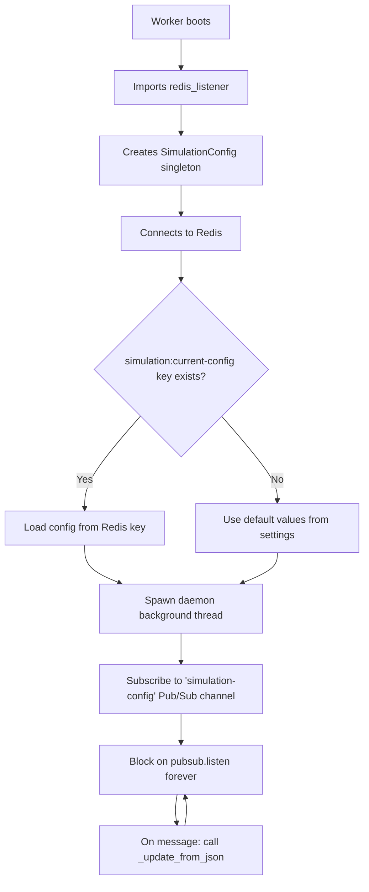
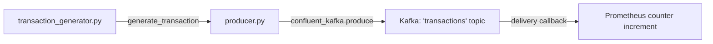
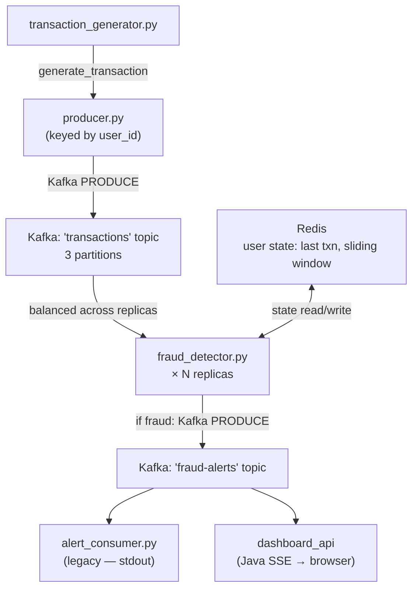

# Python Workers: Data Plane Documentation

The `/workers` directory contains all Python-based microservices that form the **data plane** of the fraud detection pipeline. All workers share a single Docker image built from `workers/Dockerfile`, with the specific script to run injected per-service via Docker Compose's `command` field.

---

## Overview: Shared Image Architecture

All three workers (`producer`, `fraud-detector`, `alert-consumer`) are built from the same `python:3.12-slim` image. This is an intentional design decision: they share the same dependencies (`confluent-kafka`, `redis`, `prometheus_client`) and the same support modules (`config.py`, `redis_listener.py`, `transaction_generator.py`). Building one shared image is significantly faster and more cache-efficient than maintaining three separate Dockerfiles.

```
workers/
├── Dockerfile                  ← Single shared image for all three Python services
├── producer.py                 ← Transaction simulation & Kafka publishing
├── fraud_detector.py           ← Fraud rule evaluation & alert publishing
├── alert_consumer.py           ← Alert display/forwarding service (legacy)
├── redis_listener.py           ← Live config subscriber (singleton module)
├── transaction_generator.py    ← Transaction data factory
├── config.py                   ← Centralised settings & serialization helpers
├── requirements.txt            ← Runtime dependencies
└── data/
    └── users.json              ← Simulated user profiles (home locations)
```

---

## Module: `config.py` — Centralised Settings & Serialization

**Role:** Single source of truth for all environment-driven configuration values. Every other module imports `settings` from this file rather than calling `os.getenv()` directly.

**Key Design Decisions:**
- Uses a `@dataclass(frozen=True)` for immutability — once the app boots, settings cannot be mutated accidentally by any code path.
- Loads a `.env` file via `python-dotenv` before reading `os.getenv()`, allowing local development overrides without polluting the host's environment.
- Defaults are set for Docker Compose service names (e.g., `kafka:9092`, `redis`) so workers work out of the box inside the container network.

**Configuration Values:**

| Setting | Environment Variable | Default | Description |
| :--- | :--- | :--- | :--- |
| `kafka_bootstrap_servers` | `KAFKA_BOOTSTRAP_SERVERS` | `kafka:9092` | Kafka broker for Compose; use `localhost:9094` locally |
| `redis_host` | `REDIS_HOST` | `redis` | Redis host (service name inside Docker) |
| `redis_port` | `REDIS_PORT` | `6379` | Redis port |
| `transactions_topic` | `TRANSACTIONS_TOPIC` | `transactions` | Kafka topic for raw transactions |
| `fraud_alerts_topic` | `FRAUD_ALERTS_TOPIC` | `fraud-alerts` | Kafka topic for fraud alert events |
| `fraud_amount_threshold` | `FRAUD_AMOUNT_THRESHOLD` | `5000.0` | USD threshold for huge-amount fraud rule |
| `location_max_distance_km` | `LOCATION_MAX_DISTANCE_KM` | `800.0` | km gap triggering impossible-travel rule |
| `repeat_window_seconds` | `REPEAT_WINDOW_SECONDS` | `60` | Sliding window duration for high-frequency rule |
| `repeat_txn_count_threshold` | `REPEAT_TXN_COUNT_THRESHOLD` | `4` | Transaction count within window that triggers rule |
| `producer_metrics_port` | `PRODUCER_METRICS_PORT` | `8000` | Prometheus metrics HTTP port for producer |
| `detector_metrics_port` | `DETECTOR_METRICS_PORT` | `8002` | Prometheus metrics HTTP port for fraud detector |
| `alert_consumer_metrics_port` | `ALERT_CONSUMER_METRICS_PORT` | `8003` | Prometheus metrics HTTP port for alert consumer |
| `num_users` | `NUM_USERS` | `100` | Default size of the active user pool (overridable live) |

**Serialization Helpers:** `json_serializer()` and `json_deserializer()` are pure utility functions that convert Python dicts to/from UTF-8 JSON bytes — the wire format Kafka expects.

---

## Module: `redis_listener.py` — Live Configuration Manager

**Role:** A background Singleton that bridges the Java Cluster Controller's configuration broadcasts (via Redis Pub/Sub) to the running Python worker process. It allows simulation parameters to be changed live without restarting any containers.

**Architecture Pattern — Singleton:**
The `SimulationConfig` class implements the Singleton pattern using Python's `__new__`. When any module does `from redis_listener import config_state`, they all get the exact same object in memory. This guarantees only one Redis connection and one background thread exist per worker process, regardless of how many files import it.

**Startup Sequence:**


**Why a Daemon Thread?**
The listener thread is set as `daemon=True`. Daemon threads are automatically killed when the main program exits, so the background Redis connection does not prevent clean shutdown.

**Resilience:** The listener thread catches `redis.ConnectionError` and retries after 5 seconds, so temporary Redis restarts do not crash the worker permanently.

**Live State Fields (updated in-place, no lock needed for reads):**

| Field | Default | Description |
| :--- | :--- | :--- |
| `config_state.num_users` | `100` | Active user pool size for transaction generation |
| `config_state.burst_probability` | `0.25` | Probability (0.0–1.0) of a burst event per cycle |
| `config_state.speed_multiplier` | `1.0` | Speed divisor for sleep between batches (`base_delay / speed`) |

> **Note on Thread Safety:** Python's GIL (Global Interpreter Lock) ensures that simple attribute assignments (`self.num_users = int(...)`) are atomic at the bytecode level. This is sufficient for our use case — the worst case is a worker reads an old value for one cycle before the update takes effect.

---

## Module: `transaction_generator.py` — Transaction Data Factory

**Role:** Generates a single realistic, randomised financial transaction dictionary. Called once per loop iteration by `producer.py`.

**Data Source:** Loads all user profiles from `data/users.json` at import time. Each profile includes a `user_id`, home `country`, `city`, `lat`, and `lon`.

**Transaction Structure:**

```json
{
  "transaction_id": "uuid4",
  "timestamp":      "ISO-8601 UTC",
  "event_epoch_ms": 1712000000000,
  "user_id":        "u-1042",
  "account_id":     "acc-1042",
  "amount":         142.50,
  "currency":       "USD",
  "merchant_id":    "m-442",
  "merchant_category": "grocery",
  "payment_method": "credit_card",
  "channel":        "mobile_app",
  "card_present":   false,
  "device_id":      "d-4821",
  "device_type":    "android",
  "ip_address":     "10.3.12.77",
  "country":        "SG",
  "city":           "Singapore",
  "latitude":       1.3521,
  "longitude":      103.8198
}
```

**Fraud-Triggering Anomalies (injected probabilistically):**

| Anomaly | Probability | Effect |
| :--- | :--- | :--- |
| Large amount | ~10% | Sets `amount` to range `$5,500–$12,000` (above `FRAUD_AMOUNT_THRESHOLD`) |
| Location anomaly | ~8% | Overrides location with a distant city (New York, London, or Sydney) |

**Dynamic Scaling:** `active_user_ids` is re-sliced from `_ALL_USERS` on every call using the live `config_state.num_users` value. This means scaling the user pool via the Cluster Controller takes effect on the very next transaction generated.

---

## Service: `producer.py` — Transaction Producer

**Role:** The entry point for the `producer` Docker Compose service. Continuously generates synthetic financial transactions and publishes them to the `transactions` Kafka topic.

**Kafka Configuration:**
- Producer is configured with `bootstrap.servers` from `settings`.
- Key for each message is the `user_id` encoded as bytes — this guarantees **all transactions from the same user land on the same Kafka partition**, preserving ordering for the fraud detector's time-window logic.
- Uses an asynchronous delivery callback (`delivery_report`) so Kafka confirms delivery without blocking the main thread.

**Burst Logic:**
On each loop iteration, the producer first reads `config_state.burst_probability`. With that probability, it generates 2–5 transactions back-to-back before flushing. This deliberately exercises the high-frequency fraud detection rule.

**Inter-batch Delay:**
```python
base_delay = random.uniform(0.3, 1.2)
time.sleep(base_delay / config_state.speed_multiplier)
```
The `speed_multiplier` from Redis config divides the sleep duration. At `speed_multiplier = 3.0`, the producer runs ~3× faster. At `1.0` it runs at normal speed.

**Prometheus Metrics Exposed (port 8000):**

| Metric | Type | Description |
| :--- | :--- | :--- |
| `producer_transactions_produced_total` | Counter | Total transactions successfully acknowledged by Kafka |
| `producer_errors_total` | Counter | Total Kafka delivery failures |

**Data Flow:**


---

## Service: `fraud_detector.py` — Fraud Detection Engine

**Role:** The core intelligence of the pipeline. Subscribes to the `transactions` Kafka topic, evaluates each transaction against three fraud heuristics backed by Redis state, and publishes alerts to the `fraud-alerts` topic.

**Kafka Consumer Group:** `fraud-detector-group`
- Multiple replicas of this service share this group ID. Kafka automatically distributes topic partitions across replicas so each transaction is processed by exactly one replica — the foundation of horizontal scalability.

**Fraud Rules:**

### Rule 1: Huge Amount
```python
if float(txn["amount"]) >= settings.fraud_amount_threshold:
    reasons.append("huge_amount")
```
Simple threshold check. No Redis state required. Triggers if a single transaction exceeds `$5,000` (configurable).

### Rule 2: Location Anomaly (Impossible Travel)
```python
distance = haversine_km(prev_lat, prev_lon, curr_lat, curr_lon)
if distance >= settings.location_max_distance_km:
    reasons.append("location_anomaly")
```
Computes the great-circle distance between a user's last recorded location and the current transaction's location using the **Haversine formula**. If the distance exceeds `800 km` (configurable), it flags impossible travel.

**Redis State:** `user:last_txn:{user_id}` — a JSON string storing the previous transaction's `transaction_id`, `timestamp`, `country`, `city`, `latitude`, `longitude`. TTL: 24 hours.

### Rule 3: High-Frequency Transactions (Sliding Window)
```python
redis_client.zadd(user_txn_zset_key, {txn["transaction_id"]: now_epoch_ms})
redis_client.zremrangebyscore(user_txn_zset_key, 0, window_start_ms)
repeat_count = redis_client.zcard(user_txn_zset_key)
if repeat_count >= settings.repeat_txn_count_threshold:
    reasons.append("high_frequency_transactions")
```
Uses a **Redis Sorted Set** to maintain a sliding window of transaction timestamps per user:
1. Adds the current transaction (ID → epoch-ms score)
2. Removes entries older than the window start
3. Counts remaining entries

If `≥ 4` transactions appear within the 60-second window (both configurable), it triggers. The key auto-expires after `2 × window_seconds` of inactivity.

**Alert Event Schema:**
```json
{
  "alert_id":        "alert-{transaction_id}",
  "created_at":      "ISO-8601 UTC",
  "transaction":     { ...full transaction object... },
  "fraud_reasons":   ["huge_amount", "location_anomaly"],
  "detector_context": {
    "recent_transaction_count_in_window": 5,
    "window_seconds": 60,
    "distance_from_last_km": 9842.3,
    "last_country": "SG",
    "last_city": "Singapore"
  },
  "severity": "high"
}
```
Severity is `"high"` if `huge_amount` is one of the reasons, `"medium"` otherwise.

**Prometheus Metrics Exposed (port 8002):**

| Metric | Type | Labels | Description |
| :--- | :--- | :--- | :--- |
| `detector_transactions_processed_total` | Counter | `outcome=ok\|fraud` | Total transactions evaluated, split by result |
| `detector_fraud_reasons_total` | Counter | `reason=huge_amount\|location_anomaly\|high_frequency_transactions` | Count of each fraud rule triggered |
| `detector_evaluation_duration_seconds` | Histogram | — | Latency of a single fraud evaluation |
| `detector_window_transaction_count` | Gauge | — | Most recent sliding-window size seen |

---

## Service: `alert_consumer.py` — Alert Display Service (Legacy)

**Role:** A simple Kafka consumer that subscribes to the `fraud-alerts` topic and logs each alert to stdout in a human-readable format. Originally the terminal-based alert display layer; now mostly superseded by the `dashboard_api` SSE stream but kept in the codebase for standalone debugging.

**Kafka Consumer Group:** `alert-service-group`
- Independent from `fraud-detector-group` — Kafka delivers every alert to both groups independently.

**Prometheus Metrics Exposed (port 8003):**

| Metric | Type | Labels | Description |
| :--- | :--- | :--- | :--- |
| `alert_consumer_alerts_received_total` | Counter | `severity=high\|medium` | Total alerts received, split by severity |

> **Note:** In the current architecture, `alert_consumer.py` is NOT started by `docker-compose.yml` (it has been replaced by the Java `dashboard_api`). It can be run locally for debugging without Docker by setting `KAFKA_BOOTSTRAP_SERVERS=localhost:9094`.

---

## Shared Dockerfile

```dockerfile
FROM python:3.12-slim

WORKDIR /app

# Install dependencies (cached layer — only rebuilds when requirements.txt changes)
COPY requirements.txt .
RUN pip install --no-cache-dir -r requirements.txt

# Copy full application source
COPY . .

# Default command (overridden per-service in docker-compose.yml)
CMD ["python", "producer.py"]
```

**Why One Image for Three Services?**
All three workers share the same `requirements.txt` and the same support modules. Using a single image means:
- One `docker build` instead of three
- Docker's layer cache is maximally reused
- Any shared library update (e.g., a security patch to `confluent-kafka`) is applied to all services simultaneously

---

## Data Flow Summary


